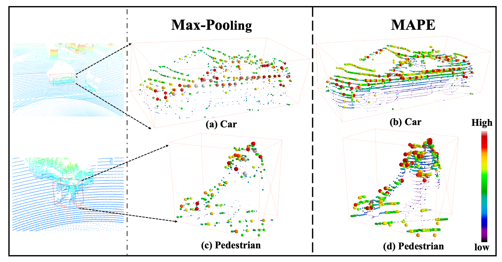

# FastPillars

**FastPillars:
A Deployment-friendly Pillar-based 3D Detector**\
*Sifan Zhou, Zhi Tian, Xiangxiang Chu, Xinyu Zhang, Bo Zhang, Xiaobo Lu, Chengjian Feng, Zequn Jie, Patrick Yin Chiang and Lin Ma*\
Southeast University, Meituan, Fudan University
[arXiv](https://arxiv.org/abs/2302.02367)

If you have any problems, please email me sifanjay@gmail.com

<div>
  
</div>
<div>
  
</div>
<div>
  
</div>
<div>

</div>

## Star History
[](https://star-history.com/#StiphyJay/FastPillars&Date)

## Citation

```
@article{zhou2023fastpillars,
  title={FastPillars: A Deployment-friendly Pillar-based 3D Detector},
  author={Zhou, Sifan and Tian, Zhi and Chu, Xiangxiang and Zhang, Xinyu and Zhang, Bo and Lu, Xiaobo and Feng, Chengjian and Jie, Zequn and Chiang, Patrick Yin and Ma, Lin},
  journal={arXiv preprint arXiv:2302.02367},
  year={2023}
}
```
## Acknowleadgement
This work was supported by National Natural Science Foundation of China (No.62271143), and the Big Data Computing Center of Southeast University.

