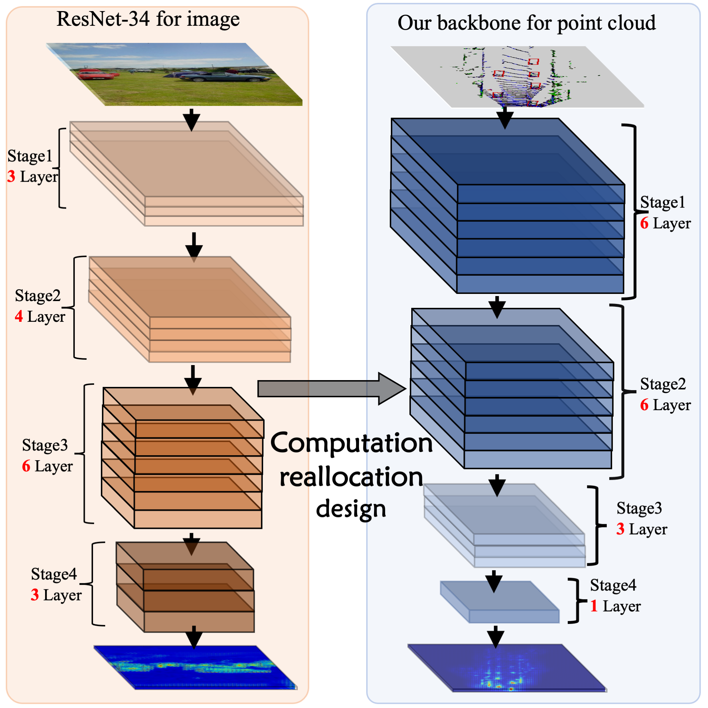
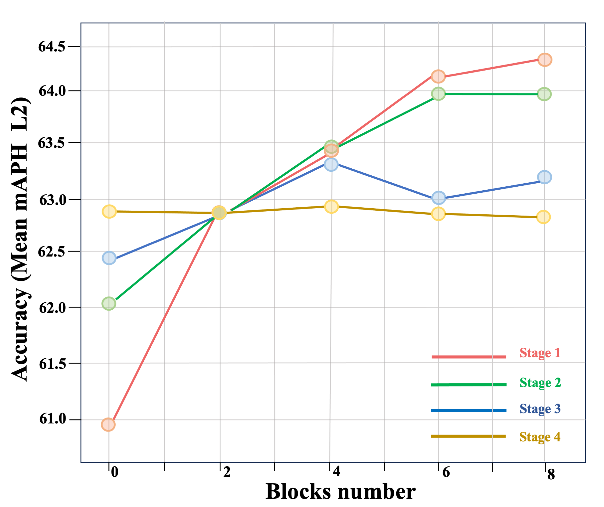

# FastPillars

<div align='center'>

**FastPillars:
A Deployment-friendly Pillar-based 3D Detector**\
*Sifan Zhou, Zhi Tian, Xiangxiang Chu, Xinyu Zhang, Bo Zhang, Xiaobo Lu, Chengjian Feng, Zequn Jie, Patrick Yin Chiang and Lin Ma*\
Southeast University, Meituan, Fudan University
[arXiv](https://arxiv.org/abs/2302.02367)
<div>
  
</div>

<div>
  
</div>

<div>
  
</div>

<div>
  
</div>

<div>
  
</div>
```
@article{zhou2023fastpillars,
  title={FastPillars: A Deployment-friendly Pillar-based 3D Detector},
  author={Zhou, Sifan and Tian, Zhi and Chu, Xiangxiang and Zhang, Xinyu and Zhang, Bo and Lu, Xiaobo and Feng, Chengjian and Jie, Zequn and Chiang, Patrick Yin and Ma, Lin},
  journal={arXiv preprint arXiv:2302.02367},
  year={2023}
}
```

# We are arranging the code and will release our code soon.
